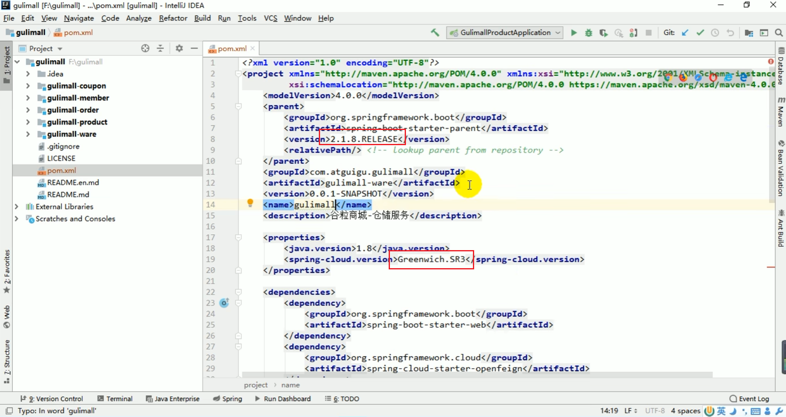
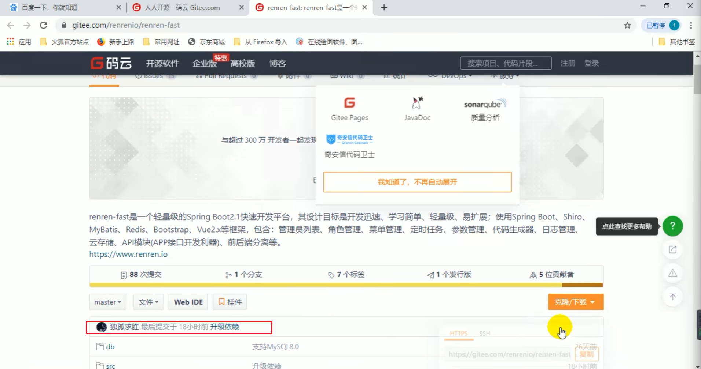
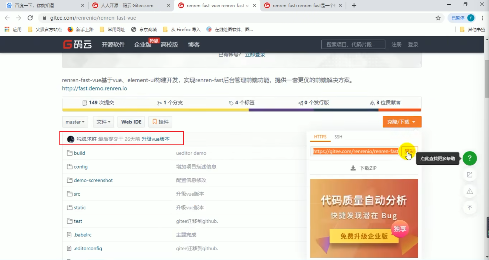
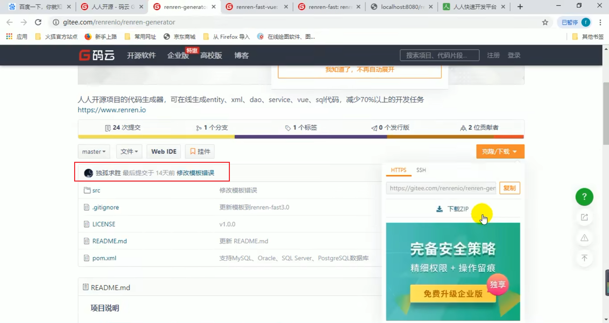

# gulimall-learning

自学谷粒商城项目的代码和笔记。同时提供Check Point功能，帮助想要跳着看的同学。

## 软件/代码版本

以下是我使用的软件/代码版本。

| 软件         | 版本     | 来源     |
| ------------ | -------- | -------- |
| 虚拟机CentOS | 7        |          |
| Node.js      | v10.16.3 | fnm      |
| Python       | 3.11.4   | Anaconda |

P14中显示老师用的Spring Boot版本为`2.1.8.RELEASE`，Spring Cloud版本为`Greenwich.SR3`。

P16中renren-fast的对应commmit hash为：`f34f4f5`

P16中renren-fast-vue的对应commit hash为：`1e0caca`

**renren-fast-vue项目中使用了`node-sass`，因此要特别注意Node.js版本号和项目版本，同时需要有Python的环境。**

P17中的renren-generator的对应commit hash为：`4a9e053`

不过这个版本在我这里跑不通，所以我用的commit hash为：`dd4f430`

