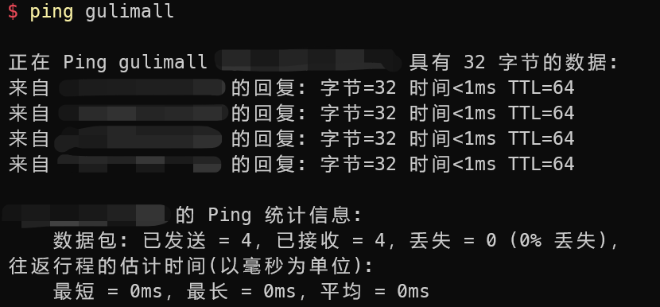
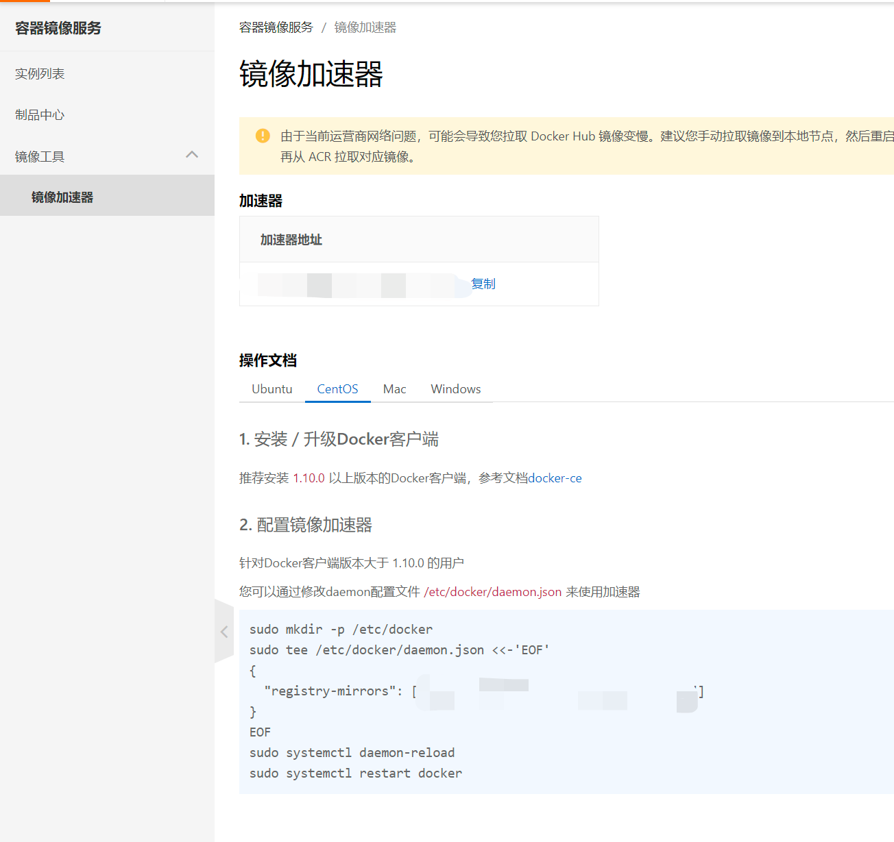

Check Point：10、环境-docker安装mysql

## 虚拟机

### 基本配置

1. 开启CPU虚拟化支持
2. 安装虚拟机软件，如VirtualBox、VMware、Hyper-V等

（视频使用的是VirtualBox+Vagrant，我使用的是Hyper-V。）

3. 安装CentOS 7虚拟机。
4. 配置虚拟机网络

在这一步中，我修改了客户端主机的hosts文件（`C:\Windows\System32\drivers\etc\hosts`），并添加了以下内容：

```
<虚拟机的IP地址> gulimall
```

因此，以后需要与虚拟机连接的场景我皆使用主机名`gulimall`代替具体的IP地址。如下图所示：



### Docker

以下内容参考：https://docs.docker.com/engine/install/centos/

#### 卸载旧版本的Docker

```shell
sudo yum remove docker \
                  docker-client \
                  docker-client-latest \
                  docker-common \
                  docker-latest \
                  docker-latest-logrotate \
                  docker-logrotate \
                  docker-engine
```

#### 安装

```shell
sudo yum install -y yum-utils
sudo yum-config-manager --add-repo https://download.docker.com/linux/centos/docker-ce.repo
```

```shell
sudo yum install docker-ce docker-ce-cli containerd.io docker-buildx-plugin docker-compose-plugin
```

#### 启动Docker

```shell
sudo systemctl start docker
```

#### 设置开机自启

```shell
sudo systemctl enable docker
```

#### 将用户添加至docker组（视频中没有）

```shell
sudo usermod -aG docker $USER
```

需要退出后重新登录。

#### 配置镜像加速

打开：[容器镜像服务-镜像加速器](https://cr.console.aliyun.com/cn-hangzhou/instances/mirrors)

按操作文档操作即可：



## MySQL

### 创建实例并启动

```shell
su -
```

```shell
docker run -p 3306:3306 --name mysql \
-v /mydata/mysql/log:/var/log/mysql \
-v /mydata/mysql/data:/var/lib/mysql \
-v /mydata/mysql/conf:/etc/mysql \
-e MYSQL_ROOT_PASSWORD=root \
-d mysql:5.7
```

### MySQL配置

创建并修改配置文件：

```shell
vi /mydata/mysql/conf/my.cnf
```

配置文件内容：

```cnf
[client]
default-character-set=utf8

[mysql]
default-character-set=utf8

[mysqld]
init_connect='SET collation_connection = utf8_unicode_ci'
init_connect='SET NAMES utf8'
character-set-server=utf8
collation-server=utf8_unicode_ci
skip-character-set-client-handshake
skip-name-resolve
```

重启MySQL：

```shell
docker restart mysql
```

