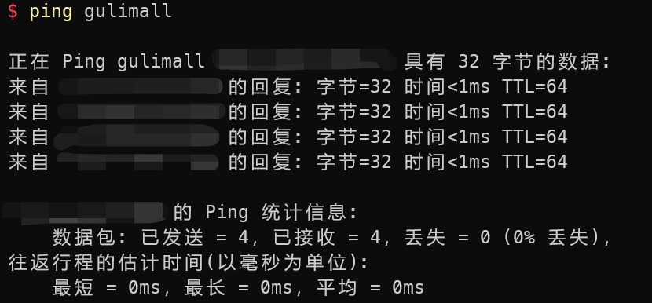
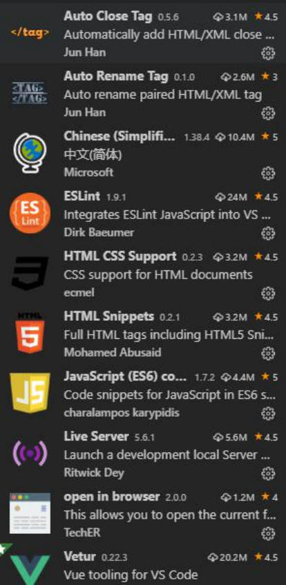

Check Point：20、分布式组件-SpringCloud Alibaba简介

## 虚拟机

### 基本配置

1. 开启CPU虚拟化支持
2. 安装虚拟机软件，如VirtualBox、VMware、Hyper-V等

（视频使用的是VirtualBox+Vagrant，我使用的是Hyper-V。）

3. 安装CentOS 7虚拟机。
4. 配置虚拟机网络

在这一步中，我修改了客户端主机的hosts文件（`C:\Windows\System32\drivers\etc\hosts`），并添加了以下内容：

```
<虚拟机的IP地址> gulimall
```

因此，以后需要与虚拟机连接的场景我皆使用主机名`gulimall`代替具体的IP地址。如下图所示：



### Docker

以下内容参考：https://docs.docker.com/engine/install/centos/

#### 卸载旧版本的Docker

```shell
sudo yum remove docker \
                  docker-client \
                  docker-client-latest \
                  docker-common \
                  docker-latest \
                  docker-latest-logrotate \
                  docker-logrotate \
                  docker-engine
```

#### 安装

```shell
sudo yum install -y yum-utils
sudo yum-config-manager --add-repo https://download.docker.com/linux/centos/docker-ce.repo
```

```shell
sudo yum install docker-ce docker-ce-cli containerd.io docker-buildx-plugin docker-compose-plugin
```

#### 启动Docker

```shell
sudo systemctl start docker
```

#### 设置开机自启

```shell
sudo systemctl enable docker
```

#### 将用户添加至docker组（视频中没有）

```shell
sudo usermod -aG docker $USER
```

需要退出后重新登录。

#### 配置镜像加速

打开：[容器镜像服务-镜像加速器](https://cr.console.aliyun.com/cn-hangzhou/instances/mirrors)

按操作文档操作即可：


## MySQL

### 创建实例并启动

```shell
su -
```

```shell
docker run -p 3306:3306 --name mysql \
-v /mydata/mysql/log:/var/log/mysql \
-v /mydata/mysql/data:/var/lib/mysql \
-v /mydata/mysql/conf:/etc/mysql \
-e MYSQL_ROOT_PASSWORD=root \
-d mysql:5.7
```

### MySQL配置

创建并修改配置文件：

```shell
vi /mydata/mysql/conf/my.cnf
```

配置文件内容：

```cnf
[client]
default-character-set=utf8

[mysql]
default-character-set=utf8

[mysqld]
init_connect='SET collation_connection = utf8_unicode_ci'
init_connect='SET NAMES utf8'
character-set-server=utf8
collation-server=utf8_unicode_ci
skip-character-set-client-handshake
skip-name-resolve
```

重启MySQL：

```shell
docker restart mysql
```

MySQL自动启动：

```shell
sudo docker update mysql --restart=always
```

## Redis

```shell
su -
```

```shell
mkdir -p /mydata/redis/conf
touch /mydata/redis/conf/redis.conf
docker run -p 6379:6379 --name redis -v /mydata/redis/data:/data \
-v /mydata/redis/conf/redis.conf:/etc/redis/redis.conf \
-d redis redis-server /etc/redis/redis.conf
```

```shell
vi /mydata/redis/conf/redis.conf
```

添加以下内容：

```conf
appendonly yes
```

Redis自动启动：

```shell
sudo docker update redis --restart=always
```

## Maven

配置阿里云镜像：

```xml
<mirrors>
    <mirror>
        <id>nexus-aliyun</id>
        <mirrorOf>central</mirrorOf>
        <name>Nexus aliyun</name>
        <url>http://maven.aliyun.com/nexus/content/groups/public</url>
    </mirror>
</mirrors>
```

配置jdk1.8编译项目

```xml
<profiles>
    <profile>
        <id>jdk-1.8</id>
        <activation>
            <activeByDefault>true</activeByDefault>
            <jdk>1.8</jdk>
        </activation>
        <properties>
            <maven.compiler.source>1.8</maven.compiler.source>
            <maven.compiler.target>1.8</maven.compiler.target>
            <maven.compiler.compilerVersion>1.8</maven.compiler.compilerVersion>
        </properties>
    </profile>
</profiles>
```

这俩我只配了阿里云镜像（早就配过了），而且是在`~/.m2/setttings.xml`中配的。

## IDEA

配置IDEA使用对应的Maven和配置文件。

安装Lombok和MyBatisX和Gitee插件。（我没安装，不过最新版的IDEA似乎有带Lombok插件）

## Visual Studio Code

要安装的插件包括：



我没有安装，因为我使用的是WebStorm。

## Git相关

1. 安装Git
2. 配置作者信息
3. 生成SSH密钥
4. 配置码云SSH
5. 用`ssh -T git@gitee.com`测试。

按如下设置创建码云仓库：


结果：


## Node.js

配置npm使用淘宝镜像（我没配）：

```shell
npm config set registry http://registry.npm.taobao.org/
```

