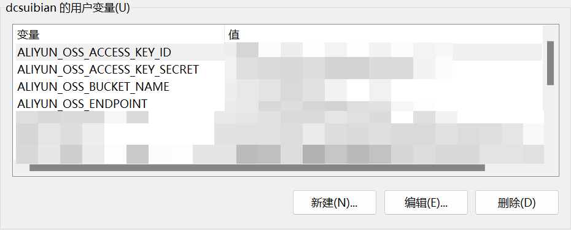

开通OSS功能，详见P61


设置bucket为能跨域访问的，详见P64


由于我不方便上传我的OSS相关配置内容，因此需要你在你的电脑上设置如下的环境变量：



| 环境变量名                   |
| ---------------------------- |
| ALIYUN_OSS_ACCESS_KEY_ID     |
| ALIYUN_OSS_ACCESS_KEY_SECRET |
| ALIYUN_OSS_BUCKET_NAME       |
| ALIYUN_OSS_ENDPOINT          |


另外，需要你在前端代码中用vscode检索并替换掉如下内容：

```
http://gulimall-dcsuibian.oss-cn-hangzhou.aliyuncs.com
```

数据库中的图片地址也要

