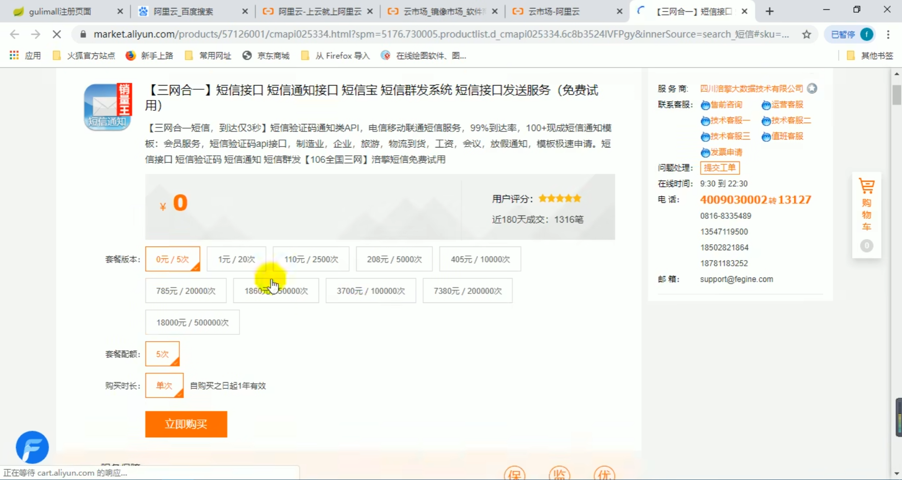
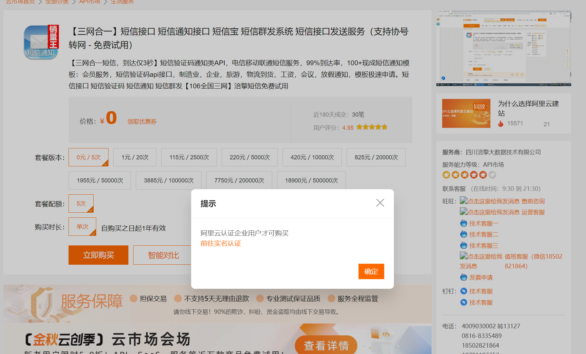
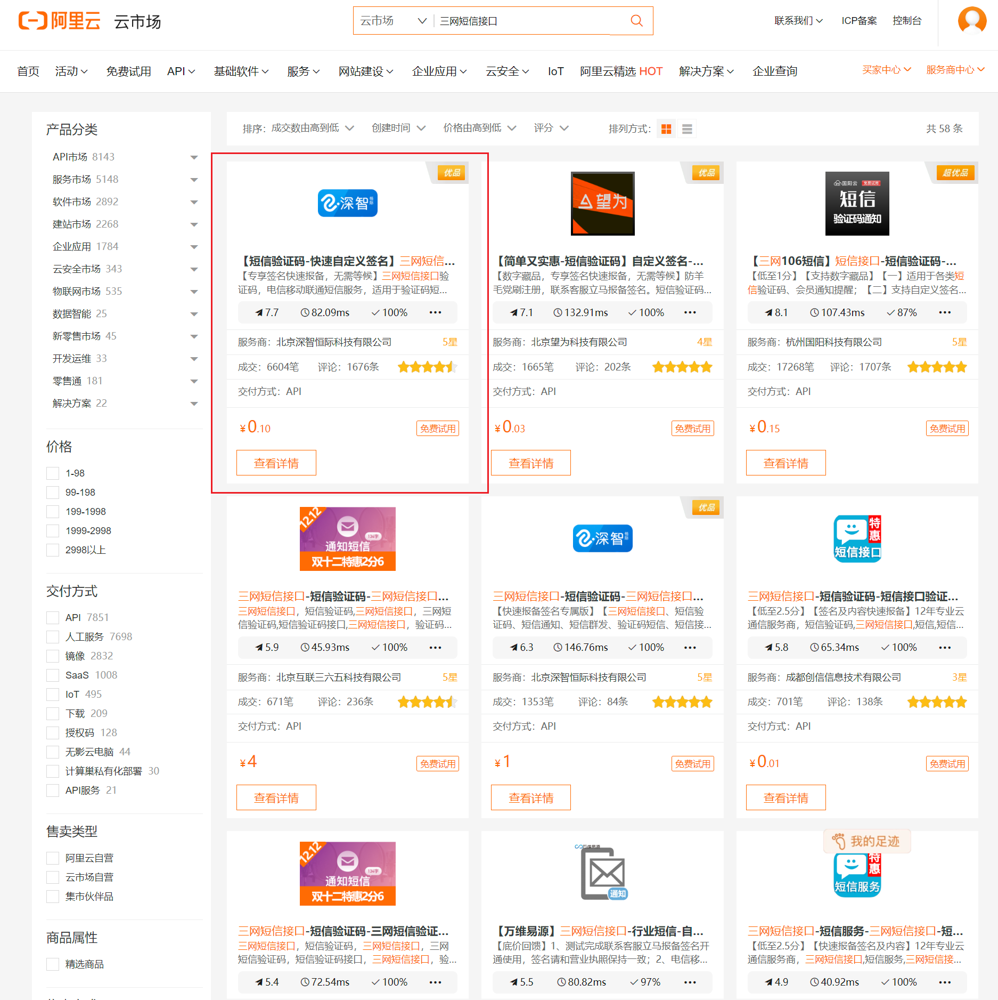
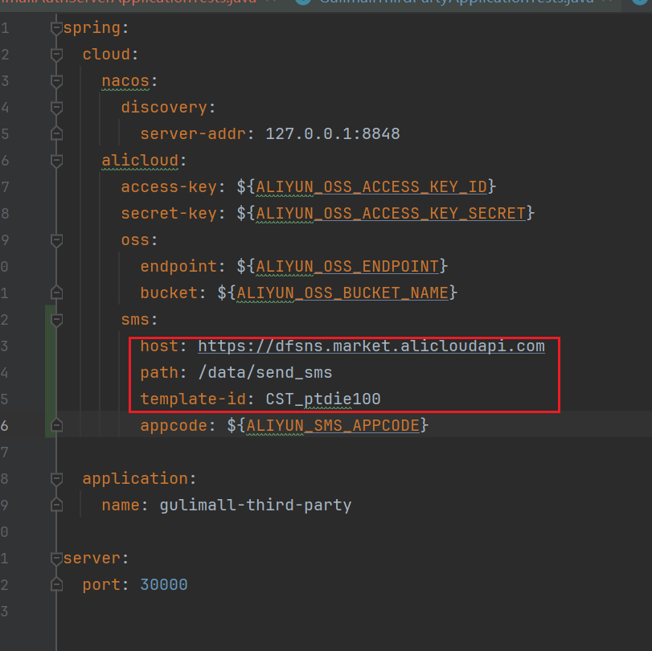

详见P213：商城业务-认证服务-整合短信验证码

本文档编写于：2023/11/06

视频中使用的是四川涪擎大数据技术有限公司提供的短信服务：

但是目前此服务仅限企业用户购买：

因此，本人不得不使用其他的短信服务。非打广告。我使用的是北京深智恒际科技有限公司提供的服务（单纯是因为它默认排在第一个）：

https://market.aliyun.com/apimarket/detail/cmapi00037170

我假设你使用的也是此服务。

需要你在你的电脑上设置如下的环境变量：

| 环境变量名 |
| ---------------------------- |
| ALIYUN_SMS_APPCODE |

若非如此，或新的发送方式有较大变化，请修改`gulimall\gulimall-third-party\src\main\resources\application.yml`和`gulimall\gulimall-third-party\src\main\java\com\atguigu\gulimall\thirdparty\component\SmsComponent.java`。

