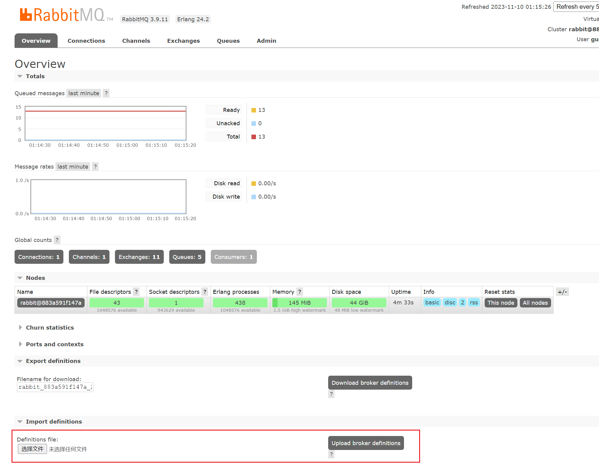

# 如何运行本项目

本篇文章中虚拟机命令皆以root用户执行。

## 虚拟机

### 基本配置

1. 开启CPU虚拟化支持
2. 安装虚拟机软件，如VirtualBox、VMware、Hyper-V等
3. 安装CentOS 7虚拟机。
4. 配置虚拟机网络，使其与宿主机在同一局域网

### Docker

以下内容参考：https://docs.docker.com/engine/install/centos/

#### 卸载旧版本的Docker

```shell
yum remove docker \
                  docker-client \
                  docker-client-latest \
                  docker-common \
                  docker-latest \
                  docker-latest-logrotate \
                  docker-logrotate \
                  docker-engine
```

#### 安装

```shell
yum install -y yum-utils
yum-config-manager --add-repo https://download.docker.com/linux/centos/docker-ce.repo
```

```shell
yum install docker-ce docker-ce-cli containerd.io docker-buildx-plugin docker-compose-plugin
```

#### 启动Docker

```shell
systemctl start docker
```

#### 设置开机自启

```shell
systemctl enable docker
```

#### 配置镜像加速

打开：[容器镜像服务-镜像加速器](https://cr.console.aliyun.com/cn-hangzhou/instances/mirrors)

按操作文档操作即可：


## hosts相关

由于每个用户的开发机IP地址和虚拟机IP地址可能都不一致，因此需要改hosts。

开发机：

在`C:\Windows\System32\drivers\etc\hosts`中添加以下内容（可以复制到桌面修改后再复制回去）：

```
127.0.0.1 gulimall-development-host
127.0.0.1 ssoserver.com
127.0.0.1 client1.com
127.0.0.1 client2.com
你的虚拟机IP地址 gulimall-virtual-host
你的虚拟机IP地址 gulimall.com
你的虚拟机IP地址 search.gulimall.com
你的虚拟机IP地址 item.gulimall.com
你的虚拟机IP地址 auth.gulimall.com
你的虚拟机IP地址 cart.gulimall.com
你的虚拟机IP地址 order.gulimall.com
```

虚拟机：

修改`/etc/hosts`（即`vi /etc/hosts`），添加以下内容：

```
127.0.0.1 gulimall-virtual-host
127.0.0.1 gulimall.com
127.0.0.1 search.gulimall.com
127.0.0.1 item.gulimall.com
127.0.0.1 auth.gulimall.com
127.0.0.1 cart.gulimall.com
127.0.0.1 order.gulimall.com
你的开发机IP地址 gulimall-development-host
```

## Nacos

下载[Nacos 1.1.3](https://github.com/alibaba/nacos/releases/tag/1.1.3)并解压，将本文档所在目录的`nacos.zip`的数据复制到对应文件夹内。

启动。

## mydata.tar.gz

使用Xftp等工具将本文件夹下的`mydata.tar.gz`文件夹复制至虚拟机`/`根路径下，解压：

```shell
tar -xzvf /mydata.tar.gz -C /
rm -f /mydata.tar.gz
```

## 运行容器

### MySQL

```shell
docker run -p 3306:3306 --name mysql --restart=always \
-v /mydata/mysql/log:/var/log/mysql \
-v /mydata/mysql/data:/var/lib/mysql \
-v /mydata/mysql/conf:/etc/mysql \
-e MYSQL_ROOT_PASSWORD=root \
-d mysql:5.7
```

### Redis

```shell
docker run -p 6379:6379 --name redis --restart=always \
-v /mydata/redis/data:/data \
-v /mydata/redis/conf/redis.conf:/etc/redis/redis.conf \
-d redis redis-server /etc/redis/redis.conf
```

### Elasticsearch

```shell
docker run --name elasticsearch --restart=always \
-p 9200:9200 -p 9300:9300 \
-e "discovery.type=single-node" \
-e ES_JAVA_OPTS="-Xms64m -Xmx512m" \
-v /mydata/elasticsearch/config/elasticsearch.yml:/usr/share/elasticsearch/config/elasticsearch.yml \
-v /mydata/elasticsearch/data:/usr/share/elasticsearch/data \
-v /mydata/elasticsearch/plugins:/usr/share/elasticsearch/plugins \
-d elasticsearch:7.4.2
```

### Kibana

```shell
docker run --name kibana --restart=always \
--add-host gulimall-virtual-host:你的虚拟机IP地址 \
-e ELASTICSEARCH_HOSTS=http://gulimall-virtual-host:9200 \
-p 5601:5601 \
-d kibana:7.4.2
```

### Nginx

```shell
docker run -p 80:80 --name nginx --restart=always \
--add-host gulimall-virtual-host:你的虚拟机IP地址 \
--add-host gulimall-development-host:你的开发机IP地址 \
-v /mydata/nginx/html:/usr/share/nginx/html \
-v /mydata/nginx/logs:/var/log/nginx \
-v /mydata/nginx/conf:/etc/nginx \
-d nginx:1.10
```

### RabbitMQ

```shell
docker run -d --name rabbitmq --restart=always \
-p 5671:5671 -p 5672:5672 -p 4369:4369 -p 25672:25672 -p 15671:15671 -p 15672:15672 \
rabbitmq:management
```

在http://gulimall-virtual-host:15672（用户名/密码为guest/guest）导入本文件夹内的`rabbit_883a591f147a_XXXX-XX-XX.json`文件：



### 一些方便的命令（非需要）

停止所有容器：

```shell
docker stop mysql redis elasticsearch kibana nginx rabbitmq
```

启动所有容器：

```shell
docker start mysql redis elasticsearch kibana nginx rabbitmq
```

!!!!!!!!!!!!!!!!!!!!!!!!!!!!!!!!!!!!!!!!!!!!!!!!!!!!!!!!!!!!!!!!!!!!!!!!强制删除所有容器!!!!!!!!!!!!!!!!!!!!!!!!!!!!!!!!!!!!!!!!!!!!!!!!!!!!!!!!!!!!!!!!!!!!!!!!：

```shell
docker rm -f mysql redis elasticsearch kibana nginx rabbitmq
```

## 第三方服务相关

详见[第三方服务相关](./第三方服务相关.md)
