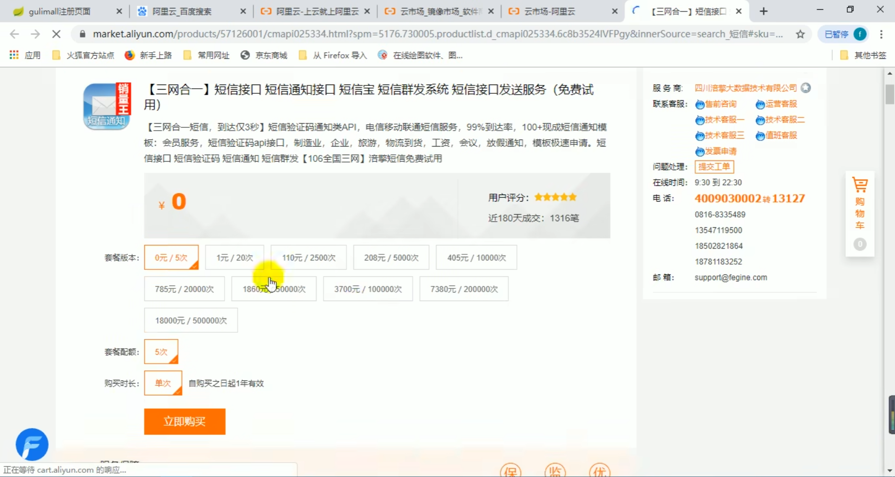
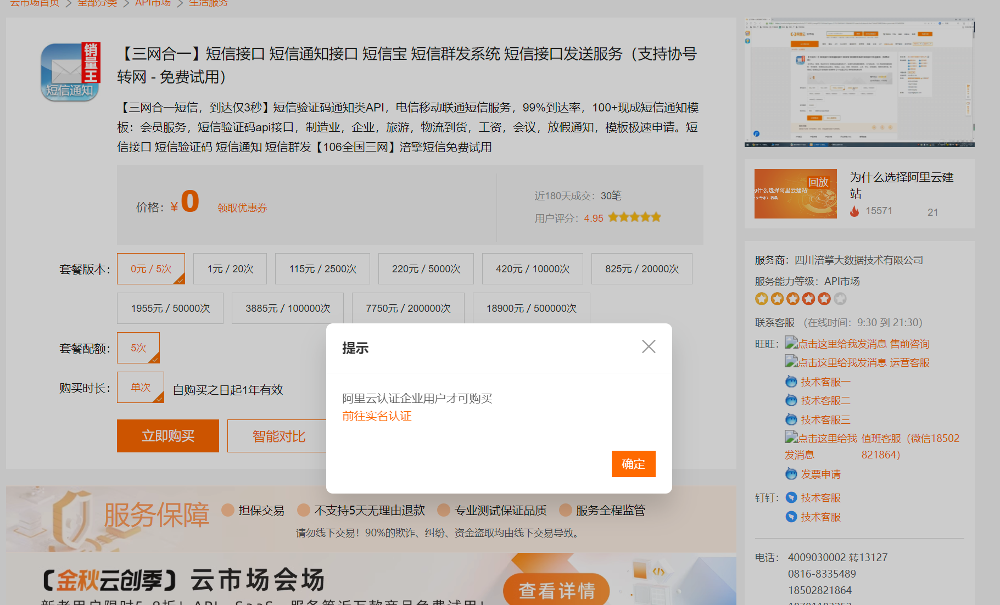
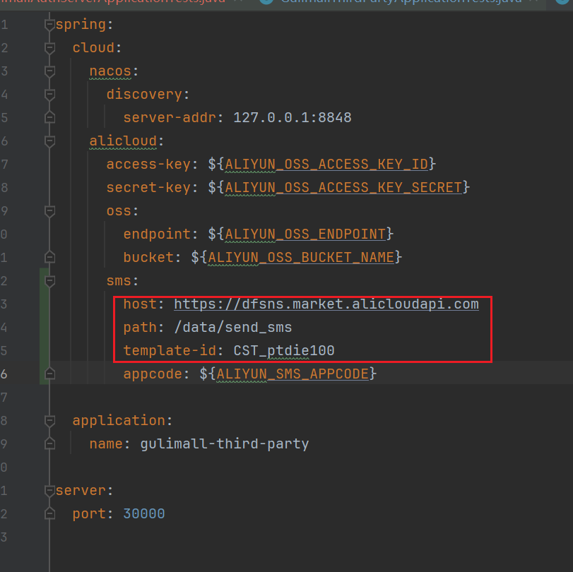

# OSS相关

开通OSS功能，详见P61


设置bucket为能跨域访问的，详见P64


由于我不方便上传我的OSS相关配置内容，因此需要你在你的电脑上设置如下的环境变量：


| 环境变量名                   |
| ---------------------------- |
| ALIYUN_OSS_ACCESS_KEY_ID     |
| ALIYUN_OSS_ACCESS_KEY_SECRET |
| ALIYUN_OSS_BUCKET_NAME       |
| ALIYUN_OSS_ENDPOINT          |


另外，需要你在前端代码中用vscode检索并替换掉如下内容：

```
gulimall-dcsuibian.oss-cn-hangzhou.aliyuncs.com
```


数据库中的图片地址也要替换掉：

```sql
SET @url='你的OSS的bucket.endpoint';
SET @old_url='gulimall-dcsuibian.oss-cn-hangzhou.aliyuncs.com';
USE `gulimall_oms`;
UPDATE `oms_order` SET `note`=REPLACE(`note`,@old_url,@url);
UPDATE `oms_order_item` SET `spu_pic`=REPLACE(`spu_pic`,@old_url,@url);
UPDATE `oms_order_item` SET `sku_pic`=REPLACE(`sku_pic`,@old_url,@url);
UPDATE `oms_order_item` SET `sku_attrs_vals`=REPLACE(`sku_attrs_vals`,@old_url,@url);
UPDATE `oms_order_operate_history` SET `note`=REPLACE(`note`,@old_url,@url);
UPDATE `oms_order_return_apply` SET `sku_img`=REPLACE(`sku_img`,@old_url,@url);
UPDATE `oms_order_return_apply` SET `sku_attrs_vals`=REPLACE(`sku_attrs_vals`,@old_url,@url);
UPDATE `oms_order_return_apply` SET `description述`=REPLACE(`description述`,@old_url,@url);
UPDATE `oms_order_return_apply` SET `desc_pics`=REPLACE(`desc_pics`,@old_url,@url);
UPDATE `oms_order_return_apply` SET `handle_note`=REPLACE(`handle_note`,@old_url,@url);
UPDATE `oms_order_return_apply` SET `receive_note`=REPLACE(`receive_note`,@old_url,@url);
UPDATE `oms_order_return_apply` SET `company_address`=REPLACE(`company_address`,@old_url,@url);
UPDATE `oms_payment_info` SET `callback_content`=REPLACE(`callback_content`,@old_url,@url);
UPDATE `oms_refund_info` SET `refund_content`=REPLACE(`refund_content`,@old_url,@url);
USE `gulimall_pms`;
UPDATE `pms_brand` SET `logo`=REPLACE(`logo`,@old_url,@url);
UPDATE `pms_sku_info` SET `sku_desc`=REPLACE(`sku_desc`,@old_url,@url);
UPDATE `pms_sku_info` SET `sku_subtitle`=REPLACE(`sku_subtitle`,@old_url,@url);
UPDATE `pms_spu_comment` SET `resources`=REPLACE(`resources`,@old_url,@url);
UPDATE `pms_spu_info` SET `spu_description`=REPLACE(`spu_description`,@old_url,@url);
USE `gulimall_sms`;
UPDATE `sms_coupon` SET `coupon_img`=REPLACE(`coupon_img`,@old_url,@url);
UPDATE `sms_home_adv` SET `pic`=REPLACE(`pic`,@old_url,@url);
UPDATE `sms_home_adv` SET `url`=REPLACE(`url`,@old_url,@url);
UPDATE `sms_home_adv` SET `note`=REPLACE(`note`,@old_url,@url);
UPDATE `sms_home_subject` SET `url`=REPLACE(`url`,@old_url,@url);
UPDATE `sms_home_subject` SET `img`=REPLACE(`img`,@old_url,@url);
USE `gulimall_ums`;
UPDATE `ums_member` SET `header`=REPLACE(`header`,@old_url,@url);
UPDATE `ums_member` SET `city`=REPLACE(`city`,@old_url,@url);
UPDATE `ums_member_collect_spu` SET `spu_name`=REPLACE(`spu_name`,@old_url,@url);
UPDATE `ums_member_collect_spu` SET `spu_img`=REPLACE(`spu_img`,@old_url,@url);
UPDATE `ums_member_collect_subject` SET `subject_img`=REPLACE(`subject_img`,@old_url,@url);
UPDATE `ums_member_collect_subject` SET `subject_urll`=REPLACE(`subject_urll`,@old_url,@url);
USE `gulimall_wms`;
UPDATE `wms_ware_order_task` SET `delivery_address`=REPLACE(`delivery_address`,@old_url,@url);
UPDATE `wms_ware_order_task` SET `task_comment`=REPLACE(`task_comment`,@old_url,@url);
```

# 短信验证码相关

详见P213：商城业务-认证服务-整合短信验证码


本文档编写于：2023/11/06


视频中使用的是四川涪擎大数据技术有限公司提供的短信服务：



但是目前此服务仅限企业用户购买：




因此，本人不得不使用其他的短信服务。非打广告。我使用的是北京深智恒际科技有限公司提供的服务（单纯是因为它默认排在第一个）：

https://market.aliyun.com/apimarket/detail/cmapi00037170


我假设你使用的也是此服务。

需要你在你的电脑上设置如下的环境变量：

| 环境变量名         |
| ------------------ |
| ALIYUN_SMS_APPCODE |

若非如此，或新的发送方式有较大变化，请修改`gulimall\gulimall-third-party\src\main\resources\application.yml`和`gulimall\gulimall-third-party\src\main\java\com\atguigu\gulimall\thirdparty\component\SmsComponent.java`。



# 微博登录相关

详见P221：商城业务-认证服务-weibo登录测试

由于微博开发者身份认证时间过长，此项功能我没有用我的AppCode和AppSecret测试过。而是直接保留了老师的AppCode和AppSecret。

时至2023年11月8号。老师还没有关闭gulimall_shop应用或修改其配置。但即使如此，也仍然会在`gulimall-member`中报403错误。导致用户名和性别设置不上。原因：https://blog.csdn.net/woshishuoshuoa/article/details/11519533


所以如果有需要这个功能的，请去申请微博网站接入，完成后自行修改`gulimall-auth-server`的`com.atguigu.gulimall.auth.OAuth2Controller`和`templates/login.html`。

# 支付宝支付相关

详见P301：商城业务-支付-支付宝沙箱&代码 ~ P303：商城业务-支付-内网穿透

需要你在你的电脑上设置如下的环境变量：

| 环境变量名                          | 备注               |
| ----------------------------------- | ------------------ |
| ALIPAY_SANDBOX_APP_ID               | 应用的id（沙箱）   |
| ALIPAY_SANDBOX_MERCHANT_PRIVATE_KEY | 商户私钥（沙箱）   |
| ALIPAY_SANDBOX_ALIPAY_PUBLIC_KEY    | 支付宝公钥（沙箱） |
| ALIPAY_SANDBOX_GATEWAY_URL          | 支付宝网关（沙箱） |
| GULIMALL_DOMAIN                     | 内网穿透的域名     |

开启内网穿透。

同时要修改你的虚拟机上的`/mydata/nginx/conf/conf.d/gulimall.conf`：


然后`docker restart nginx`。

