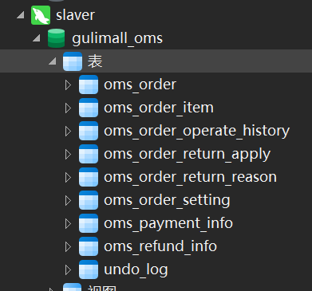
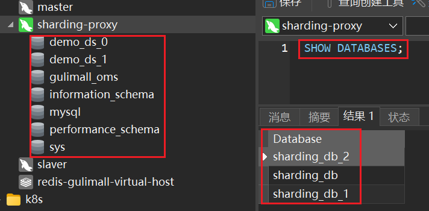
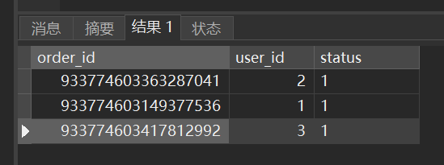
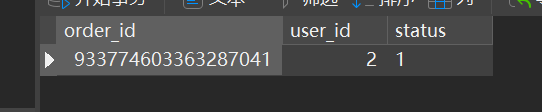
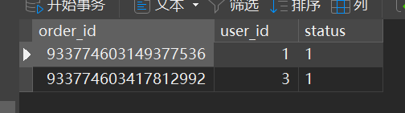
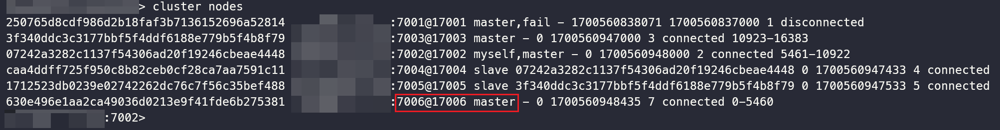
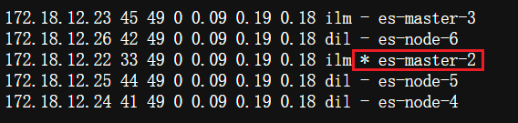
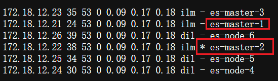
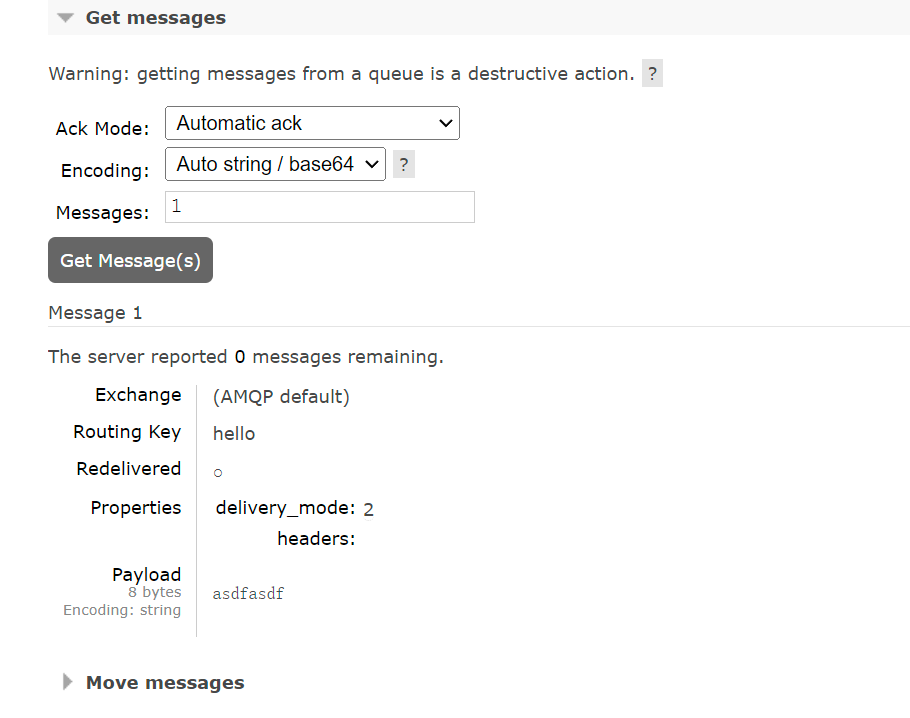

# 集群

## MySQL

### Docker安装模拟MySQL主从复制集

创建Master实例并启动：

```shell
docker run -p 3307:3306 --name mysql-master --restart=always \
 -v /mydata/mysql/master/log:/var/log/mysql \
 -v /mydata/mysql/master/data:/var/lib/mysql \
 -v /mydata/mysql/master/conf:/etc/mysql \
 -e MYSQL_ROOT_PASSWORD=root \
 -d mysql:5.7
```

创建Slave实例并启动：

```shell
docker run -p 3317:3306 --name mysql-slaver-01 --restart=always \
 -v /mydata/mysql/slaver/log:/var/log/mysql \
 -v /mydata/mysql/slaver/data:/var/lib/mysql \
 -v /mydata/mysql/slaver/conf:/etc/mysql \
 -e MYSQL_ROOT_PASSWORD=root \
 -d mysql:5.7
```

吐槽一下，老师这里用了`slaver`这个单词，有点粗心，但我们还是和他保持一致。

修改Master配置：

```shell
vi /mydata/mysql/master/conf/my.cnf
```

```ini
# 基本配置
[client]
default-character-set=utf8

[mysql]
default-character-set=utf8

[mysqld]
init_connect='SET collation_connection = utf8_unicode_ci'
init_connect='SET NAMES utf8'
character-set-server=utf8
collation-server=utf8_unicode_ci
skip-character-set-client-handshake
skip-name-resolve

# master主从复制配置
server_id=1
log-bin=mysql-bin
read-only=0
binlog-do-db=gulimall_ums
binlog-do-db=gulimall_pms
binlog-do-db=gulimall_oms
binlog-do-db=gulimall_sms
binlog-do-db=gulimall_wms
binlog-do-db=gulimall_admin
binlog-do-db=demo_ds_0
binlog-do-db=demo_ds_1

replicate-ignore-db=mysql
replicate-ignore-db=sys
replicate-ignore-db=information_schema
replicate-ignore-db=performance_schema
```

修改Slave配置：


```shell
vi /mydata/mysql/slaver/conf/my.cnf
```

```ini
# 基本配置
[client]
default-character-set=utf8

[mysql]
default-character-set=utf8

[mysqld]
init_connect='SET collation_connection = utf8_unicode_ci'
init_connect='SET NAMES utf8'
character-set-server=utf8
collation-server=utf8_unicode_ci
skip-character-set-client-handshake
skip-name-resolve

# slave主从复制配置
server_id=2
log-bin=mysql-bin
read-only=1
binlog-do-db=gulimall_ums
binlog-do-db=gulimall_pms
binlog-do-db=gulimall_oms
binlog-do-db=gulimall_sms
binlog-do-db=gulimall_wms
binlog-do-db=gulimall_admin
binlog-do-db=demo_ds_0
binlog-do-db=demo_ds_1

replicate-ignore-db=mysql
replicate-ignore-db=sys
replicate-ignore-db=information_schema
replicate-ignore-db=performance_schema
```

重启：

```shell
docker restart mysql-master mysql-slaver-01
```


连接上Master数据库，运行以下命令：

```mysql
# 添加用来同步的用户
GRANT REPLICATION SLAVE ON *.* to 'backup'@'%' identified by '123456';
# 查看master状态
show master status;
```

连接上Slave数据库，运行以下命令：

```mysql
# 设置主库连接
change master to master_host='<你的虚拟机的IP地址>',master_user='backup',master_password='123456',master_log_file='mysql-bin.000001',master_log_pos=0,master_port=3307;
# 启动从库同步
start slave;
# 查看从库状态
show slave status;
```

#### 测试

在Master中创建并导入数据库`gulimall_oms`，结果Slave也有了，成功：



### ShardingSphere

下载[Sharding-Proxy 4.0.0版](https://shardingsphere.apache.org/document/4.1.0/en/downloads/)并解压，和本文档里的`apache-shardingsphere-incubating-4.0.0-sharding-proxy-bin.zip`（里面有我写好的配置和MySQL Connector Java 5.1.47版）解压后的结果合并。

在Master创建数据库`demo_ds_0`和`demo_ds_1`，从库会自己同步过去。

启动Sharding-Proxy并指定端口：

```powershell
.\start.bat 3388
```

我用`Navicat`连接上`sharding-proxy`的结果很怪，左边显示的数据库不正常，但`SHOW DATABASES`结果就正常：



#### 测试

在`sharding-proxy`创建测试表：

```mysql
USE `sharding_db`;

CREATE TABLE `t_order` (
    `order_id` bigint(20) NOT NULL,
    `user_id` int(11) NOT NULL,
    `status` varchar(50) COLLATE utf8_bin DEFAULT NULL,
    PRIMARY KEY (`order_id`)
) ENGINE = InnoDB DEFAULT CHARSET = utf8 COLLATE = utf8_bin;

CREATE TABLE `t_order_item` (
    `order_item_id` bigint(20) NOT NULL,
    `order_id` bigint(20) NOT NULL,
    `user_id` int(11) NOT NULL,
    `content` varchar(255) COLLATE utf8_bin DEFAULT NULL,
    `status` varchar(50) COLLATE utf8_bin DEFAULT NULL,
    PRIMARY KEY (`order_item_id`)
) ENGINE = InnoDB DEFAULT CHARSET = utf8 COLLATE = utf8_bin;
```

插入测试数据：

```mysql
USE `sharding_db`;

INSERT INTO `t_order`(`user_id`,`status`) VALUES(1,1);
INSERT INTO `t_order`(`user_id`,`status`) VALUES(2,1);
INSERT INTO `t_order`(`user_id`,`status`) VALUES(3,1);

SELECT * FROM `t_order`; # 查看
```

结果：



`demo_ds_0`的`t_order_1`：



`demo_ds_1`的`t_order_0`：



分库分表测试成功。

### 清理（可选）

```shell
docker rm -f mysql-master mysql-slaver-01
rm -rf /mydata/mysql/master/ /mydata/mysql/slaver/
```

## Redis

创建6个Redis节点：

```shell
for port in $(seq 7001 7006); \
do \
mkdir -p /mydata/redis/node-${port}/conf
touch /mydata/redis/node-${port}/conf/redis.conf
cat << EOF >/mydata/redis/node-${port}/conf/redis.conf
port ${port}
cluster-enabled yes
cluster-config-file nodes.conf
cluster-node-timeout 5000
cluster-announce-ip <你的虚拟机的IP地址>
cluster-announce-port ${port}
cluster-announce-bus-port 1${port}
appendonly yes
EOF
docker run -p ${port}:${port} -p 1${port}:1${port} --name redis-${port} --restart=always \
 -v /mydata/redis/node-${port}/data:/data \
 -v /mydata/redis/node-${port}/conf/redis.conf:/etc/redis/redis.conf \
 -d redis:5.0.7 redis-server /etc/redis/redis.conf; \
done
```

使用Redis建立集群：

```shell
docker exec -it redis-7001 bash # 注意，下面进到容器里了
redis-cli --cluster create <你的虚拟机的IP地址>:7001 <你的虚拟机的IP地址>:7002 <你的虚拟机的IP地址>:7003 <你的虚拟机的IP地址>:7004 <你的虚拟机的IP地址>:7005 <你的虚拟机的IP地址>:7006 --cluster-replicas 1
```

我这边测试时，7001和7006是主-从关系，7003和7005是主-从关系，7002和7004是主-从关系。

### 测试

```shell
redis-cli -c -h <你的虚拟机的IP地址> -p 7001 # 注意这是在容器内执行的
```

```redis
set hello 1
set a aaa
get a
get aaa
set bb aa
```

可以使用GUI客户端查看数据以验证结果。

 停止节点7001：

```shell
docker stop redis-7001
docker exec -it redis-7002 /bin/bash # 进入7002的内部，因为7001宕机了
redis-cli -c -h <你的虚拟机的IP地址> -p 7002
```

可以看到7006顶了上来：



### 清理（可选）

```shell
docker rm -f redis-7001 redis-7002 redis-7003 redis-7004 redis-7005 redis-7006
rm -rf /mydata/redis/node-*
```

## ElasticSearch

运行：

```shell
sysctl -w vm.max_map_count=262144
```

创建Docker网络：

```shell
docker network create --driver bridge --subnet=172.18.12.0/16 --gateway=172.18.1.1 mynet
```

Master节点创建：

```shell
for port in $(seq 1 3); \
do \
mkdir -p /mydata/elasticsearch/master-${port}/config
mkdir -p /mydata/elasticsearch/master-${port}/data
chmod -R 777 /mydata/elasticsearch/master-${port}
cat << EOF >/mydata/elasticsearch/master-${port}/config/elasticsearch.yml
cluster.name: my-es #集群的名称，同一个集群该值必须设置成相同的
node.name: es-master-${port} #该节点的名字
node.master: true #该节点有机会成为 master 节点
node.data: false #该节点可以存储数据
network.host: 0.0.0.0
http.host: 0.0.0.0 #所有 http 均可访问
http.port: 920${port}
transport.tcp.port: 930${port}
#discovery.zen.minimum_master_nodes: 2 #设置这个参数来保证集群中的节点可以知道其它 N 个有 master 资格的节点。官方推荐（N/2）+1
discovery.zen.ping_timeout: 10s #设置集群中自动发现其他节点时 ping 连接的超时时间
discovery.seed_hosts: ["172.18.12.21:9301", "172.18.12.22:9302", "172.18.12.23:9303"] #设置集群中的 Master 节点的初始列表，可以通过这些节点来自动发现其他新加入集群的节点，es7的新增配置
cluster.initial_master_nodes: ["172.18.12.21"] #新集群初始时的候选主节点，es7 的新增配置
EOF
docker run --name elasticsearch-node-${port} --restart=always \
 -p 920${port}:920${port} -p 930${port}:930${port} \
 --network=mynet --ip 172.18.12.2${port} \
 -e ES_JAVA_OPTS="-Xms300m -Xmx300m" \
 -v /mydata/elasticsearch/master-${port}/config/elasticsearch.yml:/usr/share/elasticsearch/config/elasticsearch.yml \
 -v /mydata/elasticsearch/master-${port}/data:/usr/share/elasticsearch/data \
 -v /mydata/elasticsearch/master-${port}/plugins:/usr/share/elasticsearch/plugins \
 -d elasticsearch:7.4.2
done
```

Data-Node创建：

```shell
for port in $(seq 4 6); \
do \
mkdir -p /mydata/elasticsearch/node-${port}/config
mkdir -p /mydata/elasticsearch/node-${port}/data
chmod -R 777 /mydata/elasticsearch/node-${port}
cat << EOF >/mydata/elasticsearch/node-${port}/config/elasticsearch.yml
cluster.name: my-es #集群的名称，同一个集群该值必须设置成相同的
node.name: es-node-${port} #该节点的名字
node.master: false #该节点有机会成为 master 节点
node.data: true #该节点可以存储数据
network.host: 0.0.0.0
#network.publish_host: <你的虚拟机的IP地址> #互相通信 ip，要设置为本机可被外界访问的 ip，否则无法通信
http.host: 0.0.0.0 #所有 http 均可访问
http.port: 920${port}
transport.tcp.port: 930${port}
#discovery.zen.minimum_master_nodes: 2 #设置这个参数来保证集群中的节点可以知道其它 N 个有 master 资格的节点。官方推荐（N/2）+1
discovery.zen.ping_timeout: 10s #设置集群中自动发现其他节点时 ping 连接的超时时间
discovery.seed_hosts: ["172.18.12.21:9301", "172.18.12.22:9302", "172.18.12.23:9303"] #设置集群中的 Master 节点的初始列表，可以通过这些节点来自动发现其他新加入集群的节点，es7的新增配置
cluster.initial_master_nodes: ["172.18.12.21"] #新集群初始时的候选主节点，es7 的新增配置
EOF
docker run --name elasticsearch-node-${port} --restart=always \
 -p 920${port}:920${port} -p 930${port}:930${port} \
 --network=mynet --ip 172.18.12.2${port} \
 -e ES_JAVA_OPTS="-Xms300m -Xmx300m" \
 -v /mydata/elasticsearch/node-${port}/config/elasticsearch.yml:/usr/share/elasticsearch/config/elasticsearch.yml \
 -v /mydata/elasticsearch/node-${port}/data:/usr/share/elasticsearch/data \
 -v /mydata/elasticsearch/node-${port}/plugins:/usr/share/elasticsearch/plugins \
 -d elasticsearch:7.4.2
done
```

### 测试

http://<你的虚拟机的IP地址>:9206/_cat/nodes

http://<你的虚拟机的IP地址>:9206/_cat/health

http://<你的虚拟机的IP地址>:9206/_cluster/stats?pretty

http://<你的虚拟机的IP地址>:9206/_cluster/health?pretty

```shell
docker stop elasticsearch-node-1
```

可以看到master-1宕机后，master-2顶了上去：



http://<你的虚拟机的IP地址>:9206/_cat/nodes

```shell
docker start elasticsearch-node-1
```

可以看到master-1后来后，仍然是master-2作为主节点：



### 清理（可选）

```shell
docker stop $(docker ps -a |grep elasticsearch-node-* | awk '{ print $1}')
docker rm $(docker ps -a |grep elasticsearch-node-* | awk '{ print $1}')
rm -rf /mydata/elasticsearch/node-*
```

## RabbitMQ

```shell
# 创建文件夹
mkdir -p /mydata/rabbitmq
cd /mydata/rabbitmq
mkdir rabbitmq01 rabbitmq02 rabbitmq03

# 启动容器
docker run -d --restart=always --hostname rabbitmq01 --name rabbitmq01 -v /mydata/rabbitmq/rabbitmq01:/var/lib/rabbitmq -p 15673:15672 -p 5673:5672 -e RABBITMQ_ERLANG_COOKIE='atguigu' rabbitmq:3.8-management
docker run -d --restart=always --hostname rabbitmq02 --name rabbitmq02 -v /mydata/rabbitmq/rabbitmq02:/var/lib/rabbitmq -p 15674:15672 -p 5674:5672 -e RABBITMQ_ERLANG_COOKIE='atguigu' --link rabbitmq01:rabbitmq01 rabbitmq:3.8-management
docker run -d --restart=always --hostname rabbitmq03 --name rabbitmq03 -v /mydata/rabbitmq/rabbitmq03:/var/lib/rabbitmq -p 15675:15672 -p 5675:5672 -e RABBITMQ_ERLANG_COOKIE='atguigu' --link rabbitmq01:rabbitmq01 --link rabbitmq02:rabbitmq02 rabbitmq:3.8-management
```

节点加入集群（下面的命令要一条一条运行）：

```shell
docker exec -it rabbitmq01 /bin/bash
rabbitmqctl stop_app
rabbitmqctl reset
rabbitmqctl start_app
exit

docker exec -it rabbitmq02 /bin/bash
rabbitmqctl stop_app
rabbitmqctl reset
rabbitmqctl join_cluster --ram rabbit@rabbitmq01
rabbitmqctl start_app
exit

docker exec -it rabbitmq03 /bin/bash
rabbitmqctl stop_app
rabbitmqctl reset
rabbitmqctl join_cluster --ram rabbit@rabbitmq01
rabbitmqctl start_app
exit
```

实现镜像集群：

```shell
docker exec -it rabbitmq01 bash
rabbitmqctl set_policy -p / ha "^" '{"ha-mode":"all","ha-sync-mode":"automatic"}'
rabbitmqctl list_policies -p /
exit
```

### 测试

`rabbitmq01`发送消息，`rabbitmq03`接收消息成功：



### 清理（可选）

```shell
docker rm -f rabbitmq01 rabbitmq02 rabbitmq03
rm -rf /mydata/rabbitmq/rabbitmq*
```

