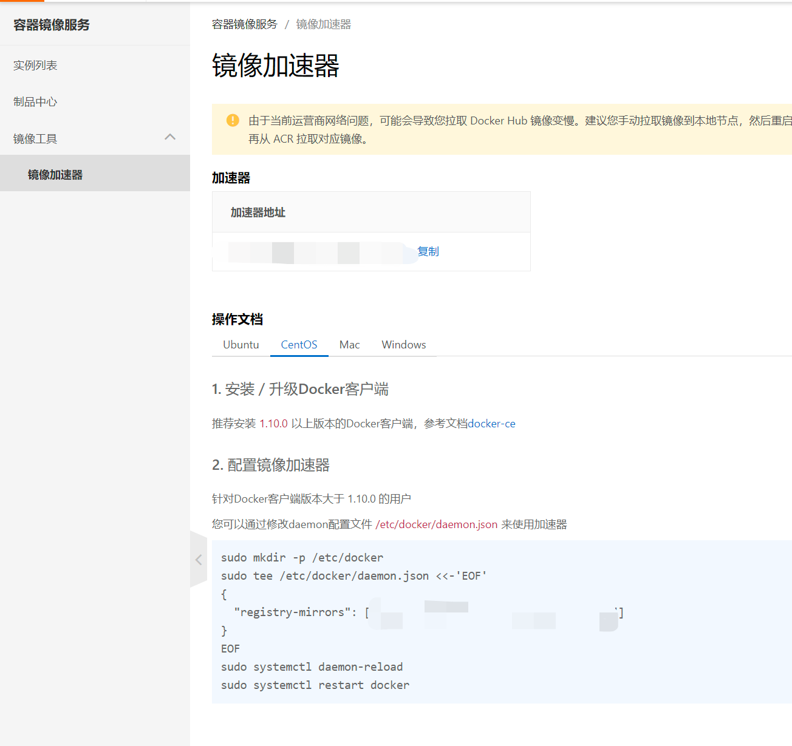
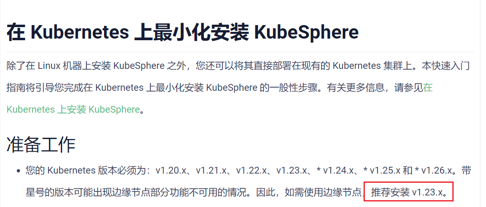
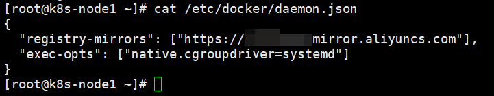
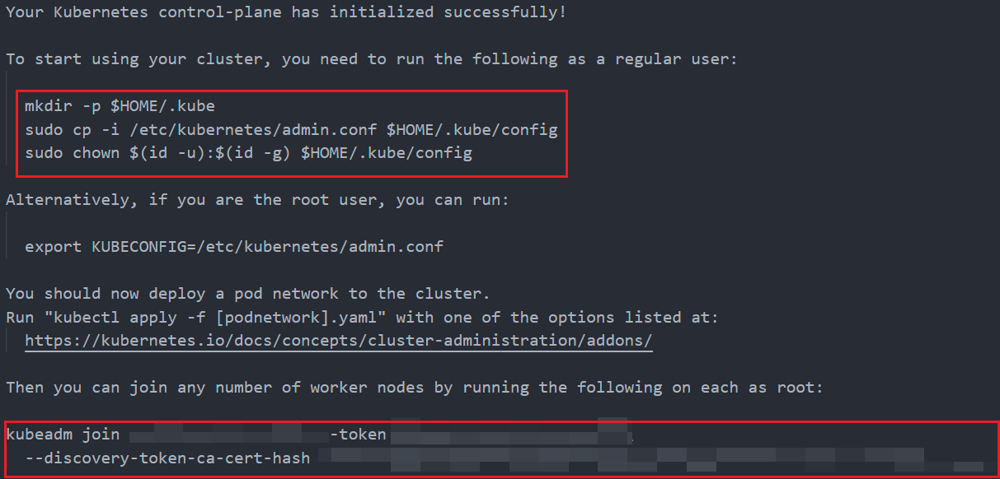

# k8s

## 前置环境

以下内容在3台主机上都要设置。

修改主机名：

```shell
hostnamectl set-hostname k8s-node<序号>
```

添加主机名与IP对应关系：

```shell
vi /etc/hosts
```

```
<k8s-node1的IP地址> k8s-node1
<k8s-node2的IP地址> k8s-node2
<k8s-node3的IP地址> k8s-node3
```

关闭防火墙：

```shell
systemctl stop firewalld
systemctl disable firewalld
```

关闭SELinux：

```shell
sed -i 's/enforcing/disabled/' /etc/selinux/config
setenforce 0
```

关闭swap：

```shell
swapoff -a
sed -ri 's/.*swap.*/#&/' /etc/fstab
free -g # 验证，swap必须为0
```

将桥接的IPv4流量传递到iptables的链：

```shell
cat > /etc/sysctl.d/k8s.conf << EOF
net.bridge.bridge-nf-call-ip6tables = 1
net.bridge.bridge-nf-call-iptables = 1
EOF
sysctl --system
```

## 安装Docker

3台主机都要安装Docker。

以下内容参考：https://docs.docker.com/engine/install/centos/

### 卸载旧版本的Docker

```shell
yum remove docker \
                  docker-client \
                  docker-client-latest \
                  docker-common \
                  docker-latest \
                  docker-latest-logrotate \
                  docker-logrotate \
                  docker-engine
```

### 安装

```shell
yum install -y yum-utils
yum-config-manager --add-repo https://download.docker.com/linux/centos/docker-ce.repo
```

```shell
yum install -y docker-ce docker-ce-cli containerd.io docker-buildx-plugin docker-compose-plugin
```

### 设置开机自启并启动

```shell
systemctl enable docker --now
```

### 配置镜像加速

打开：[容器镜像服务-镜像加速器](https://cr.console.aliyun.com/cn-hangzhou/instances/mirrors)

按操作文档操作即可：



## 添加阿里云yum源

3台主机都要配置。

```shell
cat > /etc/yum.repos.d/kubernetes.repo << EOF
[kubernetes]
name=Kubernetes
baseurl=https://mirrors.aliyun.com/kubernetes/yum/repos/kubernetes-el7-x86_64
enabled=1
gpgcheck=0
repo_gpgcheck=0
gpgkey=https://mirrors.aliyun.com/kubernetes/yum/doc/yum-key.gpg
https://mirrors.aliyun.com/kubernetes/yum/doc/rpm-package-key.gpg
EOF
```

## 安装kubeadm，kubelet和kubectl

3台主机都要安装。

为什么要使用1.23.9？因为1.24以及以上版本下官方不在支持docker作为容器运行时了，若要继续使用docker需要配置一番。而且当前当前KubeSphere官方推荐安装v1.23.x。



```shell
yum install -y kubelet-1.23.9 kubeadm-1.23.9 kubectl-1.23.9
```

```
systemctl enable --now kubelet
```

## 解决kubeadm问题

3台主机都要设置。

根据[这个问题](https://stackoverflow.com/questions/52119985/kubeadm-init-shows-kubelet-isnt-running-or-healthy)的回答，需要修改`/etc/docker/daemon.json`（即`vi /etc/docker/daemon.json`），增加以下内容：

```json
{
    "exec-opts": ["native.cgroupdriver=systemd"]
}
```

注意，由于我们之前配置过镜像加速器，所以都配置完后应该是这样：



然后：

```shell
systemctl daemon-reload
systemctl restart docker
systemctl restart kubelet
```

## 配置k8s-node1(master)

注意，只在k8s-node1(master)进行如下操作。

```shell
kubeadm init \
--apiserver-advertise-address=<k8s-node1的IP地址> \
--image-repository registry.cn-hangzhou.aliyuncs.com/google_containers \
--kubernetes-version v1.23.9 \
--service-cidr=10.96.0.0/16 \
--pod-network-cidr=10.244.0.0/16
```

运行成功以后，最后你应该能看到类似如下的文字：



请把这部分整个复制并保存到某个文件里，后面要用的。

然后就是按图中的提示，执行以下命令：

```shell
mkdir -p $HOME/.kube
cp -i /etc/kubernetes/admin.conf $HOME/.kube/config
chown $(id -u):$(id -g) $HOME/.kube/config
```

## k8s-node1(master)安装Pod网络插件（CNI）

复制我的当前文件夹下的`k8s`文件夹至`k8s-node1(master)`的`/root`。本来要从[raw.githubusercontent.com/coreos/flannel/master/Documentation/kube-flannel.yml](https://raw.githubusercontent.com/coreos/flannel/master/Documentation/kube-flannel.yml)下载的，我提前下好了。

```shell
kubectl apply -f /root/k8s/kube-flannel.yml
```

可以用`kubectl get nodes`和`kubectl get pods -A`查看状态，一定要等主节点Ready才可进行下一步。

## 从节点加入主节点

这一步的命令就来自主节点`kubectl init`以后的结果。

```shell
kubeadm join <k8s-node1的IP地址>:6443 --token <你的token> \
	--discovery-token-ca-cert-hash <你的hash> 
```

等所有节点Ready后继续。

## 入门操作Kubernetes集群

```shell
kubectl create deployment tomcat6 --image=tomcat:6.0.53-jre8 # 部署一个tomcat
kubectl get pods -o wide # 获取tomcat信息

kubectl expose deployment tomcat6 --port=80 --target-port=8080 --type=NodePort # 暴露tomcat访问
kubectl get svc -o wide # 查看端口信息，可以在外部访问

kubectl scale --replicas=3 deployment tomcat6 # 扩容
kubectl get pods -o wide # 查看数量
kubectl scale --replicas=1 deployment tomcat6 # 缩容
kubectl get pods -o wide # 查看数量

kubectl get all # 查看
kubectl delete deployment.apps/tomcat6 # 删除tomcat
kubectl delete service/tomcat6
```

yaml文件方式创建Deployment：

```shell
kubectl apply -f /root/k8s/tomcat6.yaml
kubectl get pods # 查看
```

yaml文件方式创建Pod：

```shell
kubectl apply -f /root/k8s/mypod.yaml
kubectl get pods # 查看
```

清空：

```shell
kubectl get all # 查看
kubectl delete deployment.apps/tomcat6 # 清空
kubectl delete pod/tomcat6-new
```

yaml文件方式同时创建Deployment和Service：

```shell
kubectl apply -f /root/k8s/tomcat6-deployment.yaml
kubectl get all # 查看
```

清空：

```shell
kubectl delete -f /root/k8s/tomcat6-deployment.yaml
```


**Ingress我没有跑成功，所以下面没有对应的内容。**