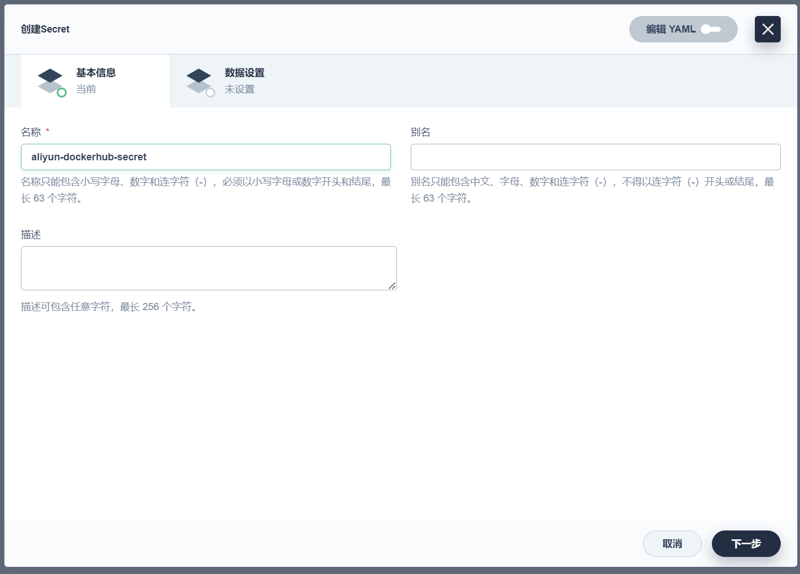
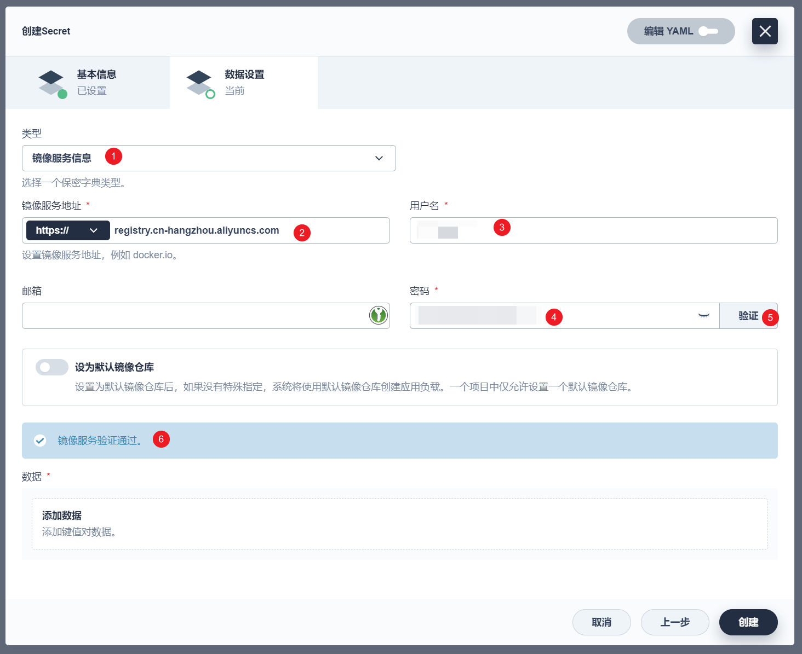

# KubeSphere

以下内容参考：

[云原生Java架构师的第一课K8s+Docker+KubeSphere+DevOps](https://www.bilibili.com/video/BV13Q4y1C7hS/)（这个视频与谷粒商城的是同一位老师）

[云原生实战（与谷粒商城是同一位老师）](https://www.yuque.com/leifengyang/oncloud)（上面视频对应的文档）

[KubeSphere官方文档](https://kubesphere.io/zh/docs/v3.4/quick-start/minimal-kubesphere-on-k8s/)

## nfs文件系统

### 1、主节点安装nfs-server

```shell
# 在master执行以下命令 
yum install -y nfs-utils

echo "/nfs/data/ *(insecure,rw,sync,no_root_squash)" > /etc/exports

# 执行以下命令，启动 nfs 服务;创建共享目录
mkdir -p /nfs/data

# 在master执行
systemctl enable rpcbind --now
systemctl enable nfs-server --now

# 使配置生效
exportfs -r

#检查配置是否生效
exportfs
```

### 2、从节点配置nfs-client（选做）

```shell
yum install -y nfs-utils
showmount -e <k8s-node1的IP地址>
mkdir -p /nfs/data
mount -t nfs <k8s-node1的IP地址>:/nfs/data /nfs/data
```

### 3、配置默认存储

在master的`/root/k8s`创建一个`sc.yaml`（即`vi /root/k8s/sc.yaml`），输入以下内容（注意里面有两个IP地址要改）：

```yaml
## 创建了一个存储类
apiVersion: storage.k8s.io/v1
kind: StorageClass
metadata:
  name: nfs-storage
  annotations:
    storageclass.kubernetes.io/is-default-class: "true"
provisioner: k8s-sigs.io/nfs-subdir-external-provisioner
parameters:
  archiveOnDelete: "true"  ## 删除pv的时候，pv的内容是否要备份

---
apiVersion: apps/v1
kind: Deployment
metadata:
  name: nfs-client-provisioner
  labels:
    app: nfs-client-provisioner
  # replace with namespace where provisioner is deployed
  namespace: default
spec:
  replicas: 1
  strategy:
    type: Recreate
  selector:
    matchLabels:
      app: nfs-client-provisioner
  template:
    metadata:
      labels:
        app: nfs-client-provisioner
    spec:
      serviceAccountName: nfs-client-provisioner
      containers:
        - name: nfs-client-provisioner
          image: registry.cn-hangzhou.aliyuncs.com/lfy_k8s_images/nfs-subdir-external-provisioner:v4.0.2
          # resources:
          #    limits:
          #      cpu: 10m
          #    requests:
          #      cpu: 10m
          volumeMounts:
            - name: nfs-client-root
              mountPath: /persistentvolumes
          env:
            - name: PROVISIONER_NAME
              value: k8s-sigs.io/nfs-subdir-external-provisioner
            - name: NFS_SERVER
              value: <k8s-node1的IP地址> ## 指定自己nfs服务器地址
            - name: NFS_PATH  
              value: /nfs/data  ## nfs服务器共享的目录
      volumes:
        - name: nfs-client-root
          nfs:
            server: <k8s-node1的IP地址>
            path: /nfs/data
---
apiVersion: v1
kind: ServiceAccount
metadata:
  name: nfs-client-provisioner
  # replace with namespace where provisioner is deployed
  namespace: default
---
kind: ClusterRole
apiVersion: rbac.authorization.k8s.io/v1
metadata:
  name: nfs-client-provisioner-runner
rules:
  - apiGroups: [""]
    resources: ["nodes"]
    verbs: ["get", "list", "watch"]
  - apiGroups: [""]
    resources: ["persistentvolumes"]
    verbs: ["get", "list", "watch", "create", "delete"]
  - apiGroups: [""]
    resources: ["persistentvolumeclaims"]
    verbs: ["get", "list", "watch", "update"]
  - apiGroups: ["storage.k8s.io"]
    resources: ["storageclasses"]
    verbs: ["get", "list", "watch"]
  - apiGroups: [""]
    resources: ["events"]
    verbs: ["create", "update", "patch"]
---
kind: ClusterRoleBinding
apiVersion: rbac.authorization.k8s.io/v1
metadata:
  name: run-nfs-client-provisioner
subjects:
  - kind: ServiceAccount
    name: nfs-client-provisioner
    # replace with namespace where provisioner is deployed
    namespace: default
roleRef:
  kind: ClusterRole
  name: nfs-client-provisioner-runner
  apiGroup: rbac.authorization.k8s.io
---
kind: Role
apiVersion: rbac.authorization.k8s.io/v1
metadata:
  name: leader-locking-nfs-client-provisioner
  # replace with namespace where provisioner is deployed
  namespace: default
rules:
  - apiGroups: [""]
    resources: ["endpoints"]
    verbs: ["get", "list", "watch", "create", "update", "patch"]
---
kind: RoleBinding
apiVersion: rbac.authorization.k8s.io/v1
metadata:
  name: leader-locking-nfs-client-provisioner
  # replace with namespace where provisioner is deployed
  namespace: default
subjects:
  - kind: ServiceAccount
    name: nfs-client-provisioner
    # replace with namespace where provisioner is deployed
    namespace: default
roleRef:
  kind: Role
  name: leader-locking-nfs-client-provisioner
  apiGroup: rbac.authorization.k8s.io
```

应用：

```shell
kubectl apply -f /root/k8s/sc.yaml
```

## 去掉master节点的Taint

```shell
kubectl taint nodes k8s-node1 node-role.kubernetes.io/master:NoSchedule-
```

## 安装Helm

仅在master上运行。

（最好开启代理）

```shell
bash /root/k8s/get-helm-3
```

## 部署 KubeSphere

仅在master上运行。

**1、执行以下命令开始安装**：

运行以下命令：


```shell
kubectl apply -f /root/k8s/kubesphere-installer.yaml
kubectl apply -f /root/k8s/cluster-configuration.yaml
```

注：原本应该是以下命令：

```shell
kubectl apply -f https://github.com/kubesphere/ks-installer/releases/download/v3.4.0/kubesphere-installer.yaml

kubectl apply -f https://github.com/kubesphere/ks-installer/releases/download/v3.4.0/cluster-configuration.yaml
```

所以`kubesphere-installer.yaml`你直接下也可以，但是`cluster-configuration.yaml`我是改过的，与原本的并不一样：打开了devops，没调Jenkins内存，打开了alerting（老师是开了devops，调了Jenkins内存，打开了SonarQube，打开了notification，打开了alerting）。

**2、检查安装日志：**


```shell
kubectl logs -n kubesphere-system $(kubectl get pod -n kubesphere-system -l 'app in (ks-install, ks-installer)' -o jsonpath='{.items[0].metadata.name}') -f
```

注，如果出现以下提示，说明installer还没好，稍等一会儿。


完成后应该看到类似下面的文字：

```
#####################################################
###              Welcome to KubeSphere!           ###
#####################################################

Console: http://<k8s-node1的IP地址>:30880
Account: admin
Password: P@88w0rd
NOTES：
  1. After you log into the console, please check the
     monitoring status of service components in
     "Cluster Management". If any service is not
     ready, please wait patiently until all components 
     are up and running.
  2. Please change the default password after login.

#####################################################
https://kubesphere.io             2023-11-20 23:25:43
#####################################################
```

建议等`kubectl get pods -A`都好了以后继续。

KubeSphere第一次登录要改密码，可以和原来的相同，我还是用初始的`P@88w0rd`。

## 安装SonarQube

步骤太多了，我直接把链接扔这儿了：[将 SonarQube 集成到流水线](https://kubesphere.io/zh/docs/v3.4/devops-user-guide/how-to-integrate/sonarqube/)

第一次登录SonarQube要改密码，不能和原来的相同，我改成了`P@88w0rd`。

## 建立多租户系统

根据[KubeSphere官方文档](https://kubesphere.io/zh/docs/v3.4/upgrade/air-gapped-upgrade-with-kubekey/)的说法，现在已经没有`user-manager`这个内置角色了，以及新版有一些其他的权限变更。所以我自己在创建用户时也做了相应调整。下面是多租户的整体结构：

| 用户名          | 邮箱                        | 角色                      | 密码      | 创建者     |
| --------------- | --------------------------- | ------------------------- | --------- | ---------- |
| atguigu-hr      | atguigu-hr@atguigu.com      | platform-admin            | Lfy123456 | admin      |
| ws-manager      | ws-manager@atguigu.com      | platform-self-provisioner | Lfy123456 | atguigu-hr |
| ws-admin        | ws-admin@atguigu.com        | platform-regular          | Lfy123456 | atguigu-hr |
| project-admin   | project-admin@atguigu.com   | platform-regular          | Lfy123456 | atguigu-hr |
| project-regular | project-regular@atguigu.com | platform-regular          | Lfy123456 | atguigu-hr |

创建企业空间：

| 企业空间名称       | 企业空间管理员 | 描述信息         | 创建者     |
| ------------------ | -------------- | ---------------- | ---------- |
| gulimall-workspace | ws-manager     | 谷粒商城企业空间 | ws-manager |
| guliedu-workspace  | ws-manager     |                  | ws-manager |

`ws-manager`邀请其他成员进入`gulimall-workspace`：

| 成员     | 角色                     |
| -------- | ------------------------ |
| ws-admin | gulimall-workspace-admin |

`ws-admin`邀请其他成员进入`gulimall-workspace`：

| 成员            | 角色                                |
| --------------- | ----------------------------------- |
| project-admin   | gulimall-workspace-self-provisioner |
| project-regular | gulimall-workspace-viewer           |

`project-admin`创建项目：

| 名称     | 别名     |
| -------- | -------- |
| gulimall | 谷粒商城 |

注意，我没有给项目限制资源。

`project-admin`创建DevOps项目（注意，KubeSphere的3.4.0在这部有一个bug，要按照[chilianyi的回答](https://ask.kubesphere.io/forum/d/22426-kubesphere-340-chuang-jian-devopsxiang-mu-bao-cuo-yi-jie-jue/8)修复这个bug）：

| 名称            | 描述信息             |
| --------------- | -------------------- |
| gulimall-devops | gulimall的自动化部署 |

`project-admin`邀请成员进入`gulimall`项目：

| 成员            | 角色     |
| --------------- | -------- |
| project-regular | operator |

`project-admin`邀请成员进入`gulimall-devops`这个DevOps项目：

| 成员            | 角色     |
| --------------- | -------- |
| project-regular | operator |

以后的步骤默认是使用`project-regular`用户的操作。

## 创建WordPress应用

### 前置步骤

在`gulimall`项目中创建保密字典：

| 名称             | 别名      | 类型 | 键                    | 值     |
| ---------------- | --------- | ---- | --------------------- | ------ |
| mysql-secret     | MySQL密钥 | 默认 | MYSQL_ROOT_PASSWORD   | 123456 |
| wordpress-secret |           | 默认 | WORDPRESS_DB_PASSWORD | 123456 |

创建持久卷声明：

| 名称          | 存储类      | 访问模式      | 卷容量 |
| ------------- | ----------- | ------------- | ------ |
| wordpress-pvc | nfs-storage | ReadWriteOnce | 10Gi   |
| mysql-pvc     | nfs-storage | ReadWriteOnce | 10Gi   |

### 创建应用

创建新应用：


| 名称                  | 版本 |
| --------------------- | ---- |
| wordpress-application | v1   |

#### 创建MySQL服务

创建服务-->有状态应用：


| 名称  | 版本 | 镜像      | 端口设置         | CPU限制 | 内存上限 | 环境变量            |
| ----- | ---- | --------- | ---------------- | ------- | -------- | ------------------- |
| mysql | v1   | mysql:5.6 | 使用默认镜像端口 | 1Core   | 1950Mi   | MYSQL_ROOT_PASSWORD |


挂载卷：


#### 创建WordPress服务

无状态服务。


| 名称      | 版本 | 镜像                 | 端口设置         |
| --------- | ---- | -------------------- | ---------------- |
| wordpress | v1   | wordpress:4.8-apache | 使用默认镜像端口 |


### 外网访问


访问模式：NodePort


## DevOps

### 创建凭证

在`gulimall-devops`里。

#### 创建Docker Hub凭证


#### 创建GitHub凭证


#### 创建kubeconfig凭证

（内容它会自己填的）


#### 创建SonarQube Token

[将 SonarQube 集成到流水线](https://kubesphere.io/zh/docs/v3.4/devops-user-guide/how-to-integrate/sonarqube/)的步骤7有写。

创建SonarQube项目`gulimall`：


生成一个token，token名填`gulimall-analyze`：


一定要记住这个token。

然后点击`continue`，选择`Maven`，并复制保存：


创建凭证：


#### 创建Gitee凭证


#### 创建阿里云镜像仓库凭证

注意不是阿里云的账户密码，是[访问凭证](https://cr.console.aliyun.com/cn-hangzhou/instance/credentials)的账户密码。


同时要有对应的命名空间：


创建凭证：


### 修改Jenkinsfile

在`gulimall-devops`里。

#### Fork项目

1. Fork [devops-java-sample](https://github.com/kubesphere/devops-java-sample)。Fork时不要选“Copy the `master` branch only”。
2. 在Gitee创建同名项目
3. 运行以下命令：

```shell
git clone <你的GitHub项目地址> # clone项目到本地
cd devops-java-sample
git checkout -b dependency origin/dependency # 创建本地对应分支
git checkout -b podman origin/podman
git checkout -b sonarqube origin/sonarqube
git remote add gitee <你的Gitee项目地址> # 添加Gitee作为remote
git push -u gitee master dependency podman sonarqube
```

由于GitHub在国内访问比较慢，因此我选择使用Gitee。

同理，由于Docker Hub访问也比较慢，所以我选择推送到

注意，视频中所用的`devops-java-sample`对应commit为`b5fa900`。你可以用这个commit试试，但我选择不这么做。


我选择直接用最新的，目前这个项目已经archived，所以应该不会再更新，以防万一还是说一下我用的commit是`551ce2d`：


目前一共有四个分支：`dependency`、`master`、`podman`、`sonarqube`。

分别对应本文档所在文件夹里的`devops-java-sample`文件夹里的四个子文件夹。


用Visual Studio Code打开本文档所在文件夹里的`devops-java-sample`，并准备开始进行全局替换操作（注意一定要开启**区分大小写**）：


替换`kubesphere@yunify.com`为`你自己的git邮箱`。


替换`user.name "kubesphere"`为`user.name "你自己的git用户名"`。


替换`kubesphere`为`你自己的Gitee用户名`。（注意，这里只替换`Jenkinsfile-online`文件内的，不要连yaml文件的也一起替换了）


替换`docker_username`为`你自己的阿里云仓库命名空间`：


然后用对应子文件夹的文件覆盖对应分支的文件并推送：


```shell
git switch dependency
# 覆盖对应的文件
git ci -am "update Jenkinsfile-online and deploy."
git push gitee dependency # 推送到Gitee

git switch master
# 覆盖对应的文件
git ci -am "update Jenkinsfile-online and deploy."
git push gitee master # 推送到Gitee

git switch podman
# 覆盖对应的文件
git ci -am "update Jenkinsfile-online and deploy."
git push gitee podman # 推送到Gitee

git switch sonarqube
# 覆盖对应的文件
git ci -am "update Jenkinsfile-online and deploy."
git push gitee sonarqube # 推送到Gitee
```

**!!!一定要用我提供的文件!!!**

原因：[kubernetesDeploy已经被弃用](https://ask.kubesphere.io/forum/d/8641-kubernetesdeploy)。

#### 创建代码仓库


#### 创建项目

登录`project-admin`用户，创建两个项目：

| 名称                   | 别名     |
| ---------------------- | -------- |
| kubesphere-sample-dev  | 开发环境 |
| kubesphere-sample-prod | 生产环境 |

邀请成员进项目：

| 项目                   | 成员            | 角色     |
| ---------------------- | --------------- | -------- |
| kubesphere-sample-dev  | project-regular | operator |
| kubesphere-sample-prod | project-regular | operator |

登出，重新用`project-regular`登录。

#### 创建保密字典

这一步要求你进入到项目`kubesphere-sample-prod`和`kubesphere-sample-dev`，在两个项目里都创建一个名为`aliyun-dockerhub-secret`的保密字典：





#### 创建流水线

创建流水线`demo-cicd`：


